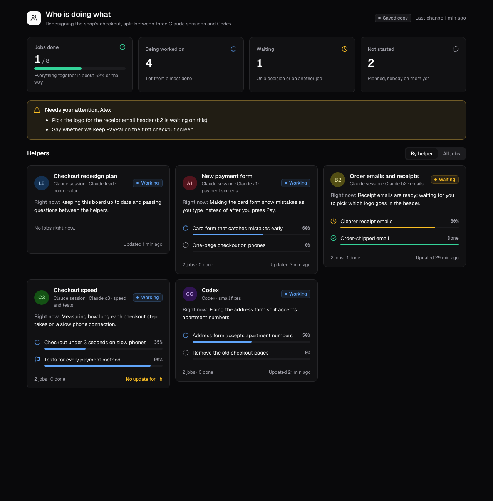

# Agent Board

A Claude Code skill that gives you one live page showing **who is doing what**
when several agents work on the same plan: Claude Code sessions, subagents,
Codex, and you.



Open [`examples/demo.html`](examples/demo.html) in a browser to click around a
sample board.

## What you see

- **Four numbers:** jobs done, being worked on, waiting, not started, plus how
  far along everything is overall.
- **Needs your attention:** the decisions only you can make, one sentence each.
- **One card per helper**, headed by the title on its session tab, with a
  status badge, a "Right now:" sentence, and each of its jobs with a progress bar.
- **All jobs:** one table of every job, who has it, its status and progress.
- **Quiet helpers stand out:** a helper marked working that has not reported
  for 45 minutes shows "No update for ...".

Everything on the page is written in everyday words. Commit hashes, ticket
codes and file names stay in fields the page does not show, so the board
reads the same to someone who has never opened the code.

## How it works

The board is a private [claude.ai Artifact](https://claude.ai) with a small
shared database. The page subscribes to it and redraws itself whenever a row
changes, so agents report by writing rows, not by sending you messages.

```
coordinator session ── creates the page, seeds helpers and jobs, invites helpers
helper sessions ────── write their own rows at every state change
you ────────────────── open one link and read it
```

The skill has two roles:

- **Coordinator:** the session you ask for a board. It finds the running
  sessions and their tab titles (`scripts/session_titles.py`), publishes the
  page, seeds every helper and job, writes a standing instruction into your
  project's memory or `CLAUDE.local.md` so every session knows the board
  exists, and messages each helper. It also fills in rows for helpers that
  cannot write themselves, such as Codex, and keeps your list of decisions current.
- **Helper:** any session working a job on the board. At every state change
  (started, milestone, blocked, needs you, done) it updates its job rows and
  its own card in one write.

The full protocol, the data schema and the writing rules are in
[`skills/agent-board/SKILL.md`](skills/agent-board/SKILL.md).

## Install

```bash
git clone https://github.com/theBCA/agent-board.git
mkdir -p ~/.claude/skills
cp -R agent-board/skills/agent-board ~/.claude/skills/
```

Restart your Claude Code sessions so they pick up the skill. Install it on
the machine where all the helper sessions run, so each of them can follow
the Helper section too.

## Use

In the session that should coordinate, ask:

> Make an agent board for this plan.

or run `/agent-board`. The session replies with the board's link. From then
on, ask it to update the board, reassign a job, or add a decision for you.

## Requirements

- Claude Code with Artifacts and the `ArtifactData` tool, signed in to a
  claude.ai account. The board is private to that account until you share it
  from the page's Share menu.
- For several sessions: Claude Code's cross-session messaging (`ListAgents`,
  `SendMessage`). Sessions running in a different permission mode may hold
  incoming messages until you approve them in that session's window.
- `python3` and the `claude` CLI on the PATH for the tab-title script.
  Without them the board falls back to session names.

## Files

| Path | What it is |
|---|---|
| `skills/agent-board/SKILL.md` | Instructions for the coordinator and for helpers, plus the data schema |
| `skills/agent-board/board.html` | The page template |
| `skills/agent-board/scripts/session_titles.py` | Lists running sessions with their tab titles |
| `examples/sample-board.json` | Sample data for the demo |
| `examples/build_demo.js` | Rebuilds `examples/demo.html` from the template and the sample data |

## License

MIT, see [LICENSE](LICENSE).
